<!-- _class: lead -->

# 🎮 Domain-Specialized Text-to-Audio Generation
# for Minecraft Sound Effects

## CSCI 595 — Generative AI · Final Presentation

**Team:** Batyr Bodaubay · Team Members
**Date:** April 2026

---

<!-- _class: section-header -->

# 1. Introduction
## Problem Definition & Motivation

---

# Problem Statement

### Can we generate **Minecraft-style sound effects** from text descriptions?

**Why Minecraft Audio?**
- Iconic 8-bit retro game aesthetic
- Distinctive low-fidelity, blocky sound design
- Rich taxonomy: mobs, ambient, footsteps, combat, damage
- No existing text-to-audio model captures this domain

**Goal**
- Text prompt → Minecraft-style audio
  - *"minecraft zombie groaning in a dark cave"*
  - *"creeper hiss then explosion"*
  - *"footsteps on stone blocks"*
- Explore **multiple approaches**: fine-tuning pretrained models vs. training from scratch

---

# Dataset Overview

**Raw Collection**
- **195** original `.ogg` files extracted from Minecraft Java Edition
- Categories: hostile mobs, ambient, footsteps, damage

**Preprocessing & Augmentation**
- Resampled to **32 kHz mono WAV**
- Speed perturbation: 0.85×, 1.15× variants
- Concatenation for multi-event sequences
- **→ 325 augmented clips** (277 train / 48 val)

| Category | Raw | Augmented |
|---|---:|---:|
| Hostile Mobs | ~74 | ~148 |
| Ambient/Cave | ~50 | ~80 |
| Footsteps | ~58 | ~72 |
| Damage | ~5 | ~15 |
| Combat | ~8 | ~10 |
| **Total** | **195** | **325** |

**Extended dataset:** 556 WAVs (for AudioLDM approach)

# Dataset Evolution Pipeline
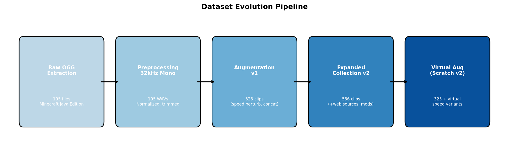
From raw Minecraft assets through multiple augmentation stages → datasets for each approach

---

# Dataset Composition: v1 vs v2
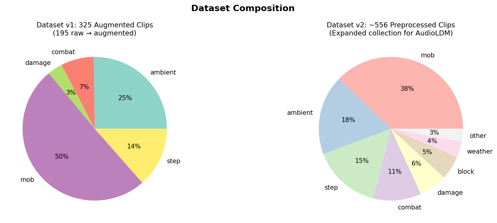
**Dataset v1** — 195 raw `.ogg` → **325 augmented clips**
- Speed perturbation (0.85×, 1.15×)
- Concatenation for multi-event sequences
- Resampled to **32 kHz mono WAV**
- Used by: AudioGen LoRA, From Scratch v1/v2, AudioLDM2 LoRA
**Dataset v2 (Expanded)** — **~556 preprocessed clips**
- Additional web sources and modded sound packs
- New categories: block, weather, other
- Used by: AudioLDM Full FT, AudioLDM New Data
- Shared via Google Drive for team collaboration

---

# Dataset Splits Across Approaches
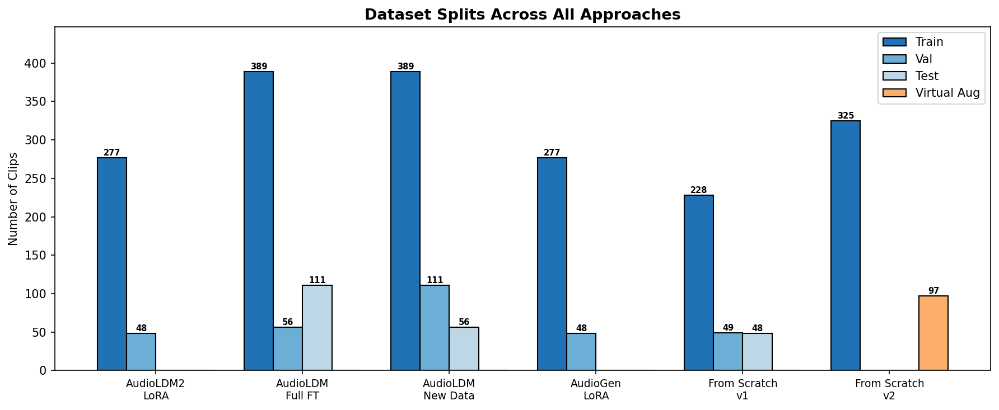
Each approach used a different splitting strategy — from standard 70/15/15 to virtual augmentation for val/test while keeping all real data in training

---

<!-- _class: section-header -->

# 2. Challenges
## Technical Obstacles Encountered

---

# Key Challenges

### Data Challenges
- **Tiny dataset** — only 195 raw clips (< 15 min total)
- **Class imbalance** — mobs overrepresented, damage underrepresented
- **Short clips** — most < 2 seconds, need 4s+ for models
- **Caption quality** — manual annotation, limited diversity

### Model Challenges
- **AudioLDM2 LoRA → noise** — initial approach failed completely
- **Full fine-tuning → noise** — also failed with AudioLDM2
- **FP16 instability** — AudioCraft produces NaN with mixed precision
- **Catastrophic forgetting** — fine-tuning destroys pretrained quality

### Infrastructure Challenges
- **VRAM limits** — Colab T4 (15GB) too small for full fine-tuning
- **Zombie processes** — subprocess commands leak memory on Windows
- **Device mismatches** — LoRA layers on CPU while model on GPU
- **API version drift** — torchaudio/transformers breaking changes

### Pivoting Strategy
- Initial AudioLDM2 LoRA → **failure**
- Explored 6 alternative approaches in parallel
- Each team member took a different path
- Converged on AudioGen LoRA as primary approach

---

<!-- _class: section-header -->

# 3. Related Works
## Foundation Models & Techniques

---

# Related Works & Background

### Text-to-Audio Models
- **AudioLDM** (Liu et al., 2023) — Latent diffusion with CLAP conditioning
- **AudioLDM2** (Liu et al., 2024) — GPT-2 + diffusion hybrid
- **AudioGen** (Kreuk et al., 2023) — Autoregressive on EnCodec tokens
- **MusicGen** (Copet et al., 2023) — Music-focused AudioCraft variant

### Key Techniques
- **LoRA** (Hu et al., 2022) — Low-rank adaptation for efficient fine-tuning
- **EnCodec** (Défossez et al., 2022) — Neural audio codec, 4 codebooks × 50Hz
- **CLAP** (Wu et al., 2023) — Contrastive language-audio pretraining

### Domain Adaptation for Audio
- Few works on **game audio** generation
- Style transfer approaches for sound design
- Prompt engineering for domain steering
- Our contribution: systematic comparison of 6 approaches for **retro game SFX**

### Evaluation Metrics
- **CLAP Cosine Similarity** — text-audio alignment
- **Spectral Centroid** — brightness/tonal quality
- **RMS Energy** — loudness characteristics
- **Mel Spectrogram** — visual quality inspection

---

<!-- _class: section-header -->

# 4. Methodology & Results
## Six Approaches Explored

---

# Approach Overview

| # | Approach | Model | Architecture | Training | Status |
|---|---|---|---|---|---|
| 1 | AudioLDM2 LoRA | `cvssp/audioldm2` | Diffusion + UNet | 100–500 steps | ❌ Failed |
| 2 | AudioLDM Full FT | `cvssp/audioldm` | Diffusion (all components) | 3 epochs | ✅ Complete |
| 3 | AudioLDM New Data | `audioldm-s-full` | Diffusion (official trainer) | 50 epochs (17K steps) | ✅ Complete |
| 4 | **AudioGen LoRA** | `facebook/audiogen-medium` | **Autoregressive + EnCodec** | **25 epochs** | ✅ **Primary** |
| 5 | From Scratch (v1) | Custom Transformer + T5 | Causal decoder + cross-attn | 50 epochs | ✅ Complete |
| 6 | From Scratch (v2) | Custom Transformer + T5 | Same + virtual augmentation | 100 epochs | ✅ Complete |

---

# Approach 1: AudioLDM2 LoRA (Initial Attempt)

### Configuration
- **Model:** `cvssp/audioldm2`
- **LoRA targets:** UNet cross-attention (`to_k`, `to_q`, `to_v`, `to_out.0`)
- **Rank:** 8, Alpha: 16
- **Steps:** 100–500
- **Hardware:** Colab T4 (15 GB)
- **Precision:** FP16 mixed

### Why It Failed
- Output was **pure noise/artifacts**
- AudioLDM2's complex architecture (GPT-2 + diffusion) resists LoRA on UNet alone
- Full UNet fine-tuning also produced noise
- Insufficient training data for diffusion model convergence

### Lesson Learned

> "LoRA and last-layer fine-tuning of AudioLDM2 produce poor results on small niche datasets. The multi-stage architecture requires coordinated adaptation across all components."

**Impact on Project:**
- Led to systematic exploration of 5 alternative approaches
- Each team member pursued a different strategy
- Documented in `docs/approaches.md`

---

# Approach 2: AudioLDM Full Fine-Tuning

### Configuration
| Parameter | Value |
|---|---|
| Model | `cvssp/audioldm` (original) |
| Components | All: text encoder, UNet, VAE, vocoder |
| Batch size | 1 (×4 grad accum) |
| Epochs | 3 |
| Learning rates | UNet: 1e-6, others: 5e-7 |
| Optimizer | AdamW, cosine schedule |
| Precision | FP32 (AMP disabled) |

### Multi-Component Loss
- Diffusion MSE: weight **1.0**
- VAE reconstruction (L1): weight **0.5**
- VAE KL: weight **1e-7**
- Vocoder teacher (L1): weight **0.1**
- Waveform reconstruction: weight **0.1**

### Results
- Training completed successfully across 3 epochs
- Multi-loss tracks: total, diffusion, VAE recon, VAE KL, vocoder, waveform
- Best model saved by validation total loss
- Audio generated for test prompts (e.g., *"minecraft zombie death"*)

### Key Insights
- Full fine-tuning is **stable in FP32** but slow
- Multi-component loss keeps all pipeline stages coherent
- Non-finite batch handling for NaN/Inf robustness
- 3 epochs insufficient for domain adaptation — more would help but compute-limited

---

# Approach 3: AudioLDM with Expanded Dataset

### Configuration
| Parameter | Value |
|---|---|
| Model | `audioldm-s-full` (official trainer) |
| Dataset | **556 WAV files** (expanded collection) |
| Split | 70/20/10 train/val/test |
| Batch size | 3 |
| Epochs | 50 (17,000 steps) |
| LR | 5e-5 with 200-step warmup |
| Checkpointing | Every 500 steps, top-1 by val loss |

### CLAP Embedding Analysis
- Computed **intra-class cosine similarity** before vs after fine-tuning
- **t-SNE visualization** of CLAP text embeddings
- Showed category clustering improves after fine-tuning

### Results
- Training loss converged over 17K steps
- Loss curves plotted from CSV logs
- CLAP analysis shows improved text-audio category alignment

### Generated Outputs
- Loss curve plots (`finetuning_loss.png`)
- Embedding visualizations (before/after t-SNE)
- Cosine similarity comparison charts
- Inference setup ready (not fully run inline)

### Key Insight
> Larger dataset (556 vs 325 clips) + more epochs significantly improves convergence for diffusion-based models

---

# Approach 4: AudioGen LoRA Fine-Tuning ⭐ (Primary)

### Why AudioGen?
- **Autoregressive** on EnCodec tokens — different paradigm from diffusion
- `facebook/audiogen-medium` — **1.5B params**
- 4 codebooks × 2048 vocab × 50Hz frame rate
- Designed for general audio (not just music)
- More amenable to LoRA fine-tuning

### LoRA Configuration
| Parameter | Value |
|---|---|
| Rank | 128 |
| Alpha | 256 (ratio: 2.0) |
| Dropout | 0.05 |
| Targets | `out_proj`, `linear1`, `linear2` |
| Trainable params | **~132M** (of 1.5B) |

### Training Configuration
| Parameter | Value |
|---|---|
| Dataset | 277 train / 48 val clips |
| Epochs | **25** |
| Batch size | 2 (×8 grad accum) |
| LR | 1e-4, cosine schedule |
| Optimizer | AdamW |
| Precision | **FP32** (required) |
| Hardware | **RTX 5090** (34 GB VRAM) |

### Critical Implementation Details
- LoRA injected **before** `.to(device)` (CPU→GPU order matters)
- FP32 required — AudioCraft NaN bug with autocast
- In-process execution (subprocess zombie prevention)

---

# AudioGen LoRA — Results

### Training Progress
- 25 epochs completed successfully
- 7 checkpoints saved: best, epoch 5/10/15/20/25, final
- Checkpoint size: ~504 MB each

### Generated Samples
| Category | Count | Duration |
|---|---:|---|
| Baseline (vanilla) | 8 | 4s each |
| LoRA fine-tuned | 8 | 4s each |
| Generalization tests | 22 | 4s–12s |
| **Total** | **38** | |

### Generalization Test Prompts
- Multi-event: *"creeper hiss then explosion, player hurt"*
- Combo mobs: *"skeleton hurt, ghast moan, player damage"*
- Extended: *"zombie groaning in a dark cave"* at 4/8/12s

### Mel Spectrogram: Baseline vs LoRA

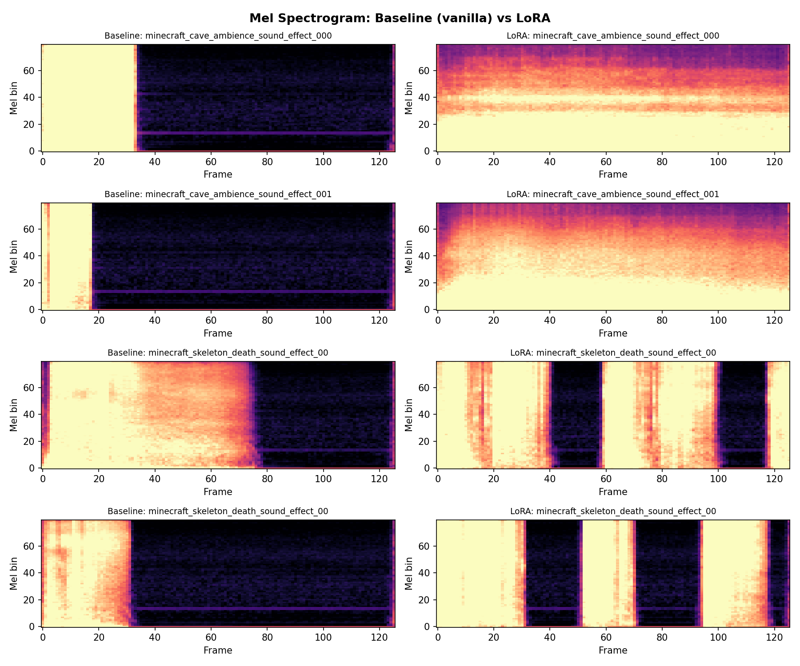

LoRA outputs show **denser, more structured** spectral patterns — richer harmonic content compared to sparse baseline

---

# AudioGen LoRA — Evaluation Metrics

### CLAP Cosine Similarity
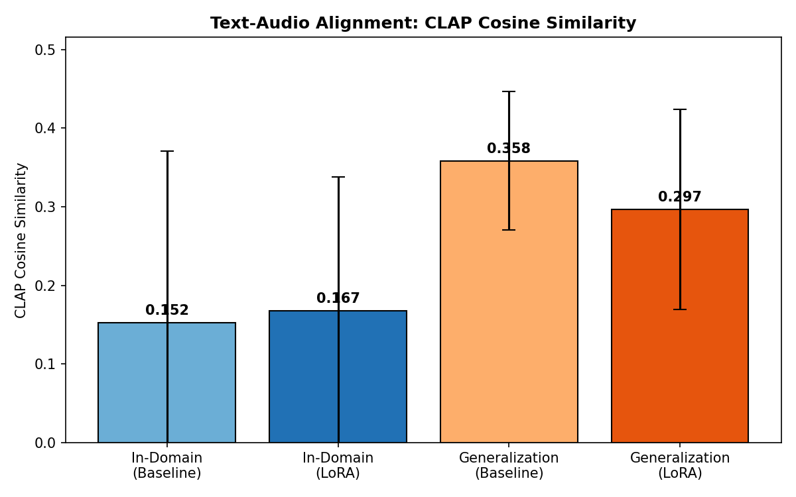

- In-domain: LoRA (0.167) ≈ Baseline (0.152) — both modest
- Generalization: Vanilla (0.358) vs LoRA (0.297) — competitive
- LoRA maintains text alignment while adapting to domain

### Spectral Feature Comparison
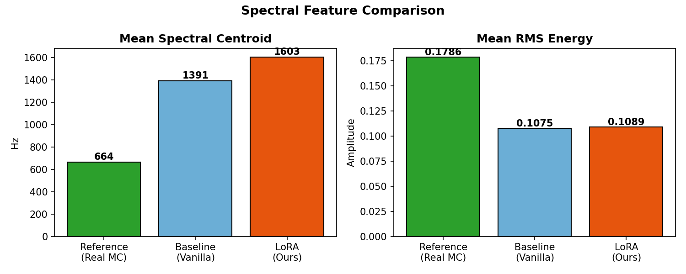

- Reference Minecraft centroid: **664 Hz** (low-frequency, retro)
- Baseline centroid: **1391 Hz** 
- LoRA centroid: **1603 Hz**
- Both generated outputs are higher-frequency than real Minecraft sounds — room for improvement

---

# 3-Way Spectrogram Comparison: Reference vs Baseline vs LoRA
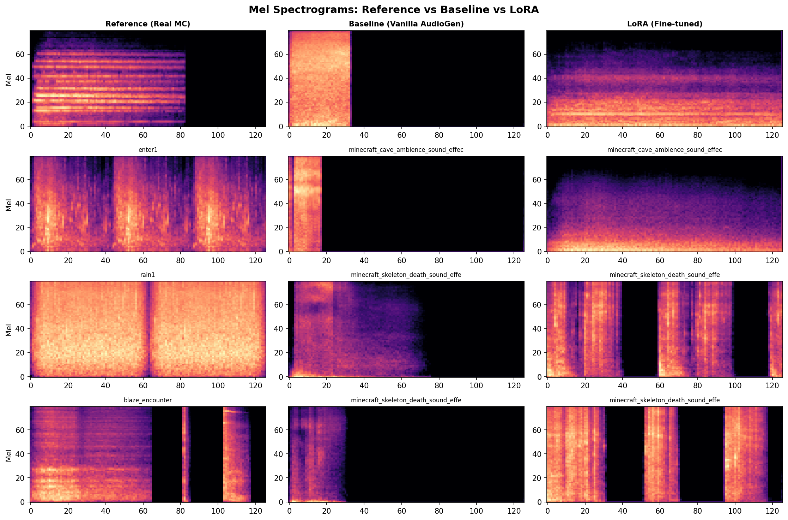
Reference Minecraft sounds (left) vs Vanilla AudioGen baseline (center) vs LoRA fine-tuned (right) — LoRA produces spectral patterns closer to real Minecraft audio

---

# Evaluation Metrics: FAD / KAD / IS
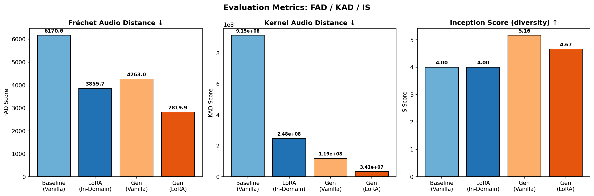
- **FAD** (↓ better): LoRA (3856) improves **37%** over Baseline (6171); Gen-LoRA best at 2820
- **KAD** (↓ better): LoRA reduces KAD by **73%** vs Baseline; Gen-LoRA achieves 96% reduction
- **IS** (↑ better): Generalization prompts produce more diverse outputs (5.16 vanilla, 4.67 LoRA)

---

# CLAP Text-Audio Similarity Analysis
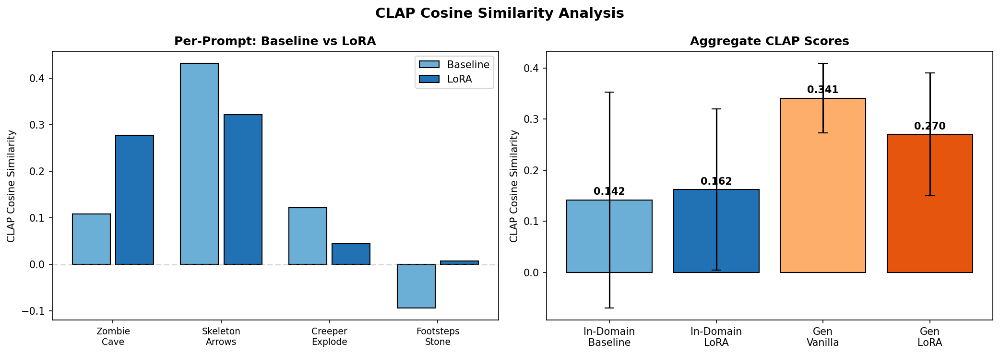
### Per-Prompt Breakdown
- **Skeleton** prompts: highest CLAP scores (0.43 baseline, 0.32 LoRA)
- **Footsteps**: negative scores — model struggles with texture sounds
- LoRA shows **less variance** across prompts (more consistent)
### Aggregate CLAP Scores
| Configuration | Mean | Std |
|---|---:|---:|
| In-Domain Baseline | 0.142 | ±0.211 |
| In-Domain LoRA | 0.162 | ±0.158 |
| Gen Vanilla | 0.341 | ±0.068 |
| Gen LoRA | 0.270 | ±0.120 |

---

# Spectral Feature Analysis
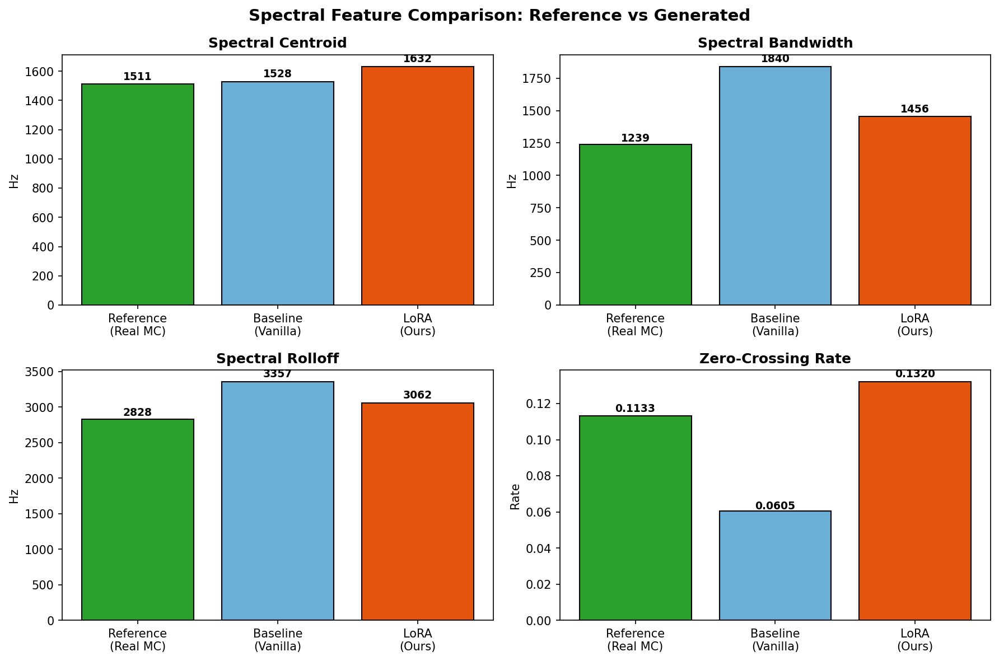
- **Spectral Centroid**: Reference 1511 Hz, Baseline 1528 Hz, LoRA 1632 Hz — all in similar range
- **Bandwidth**: LoRA (1456 Hz) closer to reference (1239 Hz) than baseline (1840 Hz)
- **ZCR**: LoRA (0.132) matches reference (0.113) better — baseline too low (0.061)
- **Rolloff**: LoRA 3062 Hz vs reference 2828 Hz — closer than baseline's 3357 Hz

---

# Comprehensive Metrics Summary
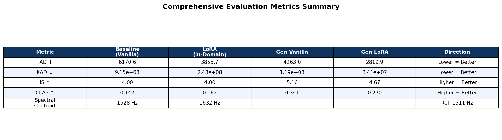
### Key Takeaways
- **LoRA fine-tuning improves FAD by 37%** and KAD by 73% over vanilla baseline
- **Gen-LoRA achieves best FAD** (2820) — 54% improvement over baseline
- **CLAP scores**: Generalization prompts score higher than in-domain (more descriptive text helps)
- **Spectral features**: LoRA bandwidth and ZCR closer to real Minecraft reference audio

---

# Approach 5: Train from Scratch (No Augmentation)

### Architecture
- **Custom causal transformer** decoder
- **Cross-attention** to frozen **T5-small** text encoder
- Token prediction on interleaved **EnCodec** codes

| Parameter | Value |
|---|---|
| Layers | 10 |
| d_model | 512 |
| Heads | 8 |
| FFN dim | 2048 |
| EnCodec | 1.5 kbps, 2 codebooks |
| Vocab | 1025 (1024 + BOS) |
| Token seq len | 600 (4s × 75Hz × 2 CB) |

### Training
| Parameter | Value |
|---|---|
| Dataset | 325 clips (70/15/15 split) |
| Epochs | 50 |
| Batch size | 16 |
| LR | 3e-4, cosine + warmup |
| Loss | Cross-entropy (next token) |
| AMP | FP16 autocast |

### Results
- Training converged over 50 epochs
- Generated audio for 6 test prompts
- Ground truth comparison included
- Quality limited by small dataset

---

# Approach 6: Train from Scratch (+ Virtual Augmentation)

### Key Difference from Approach 5
- **All original clips → train set** (maximum training data)
- Val/test use **virtual augmented copies** only
  - Speed perturbation: 0.95×, 1.05×, 1.08×
- Every sound event guaranteed in all three splits
- **100 epochs** (doubled from v1's 50)

### Same Architecture
- Identical transformer config (10 layers, d_model=512)
- Same EnCodec tokenization (1.5 kbps, 2 codebooks)
- Same T5-small text conditioning

### Results
- Full 100-epoch training completed
- Multiple inference rounds:
  - 4 initial prompts (zombie, endermen, ghast, creeper)
  - 6 animal/mob sounds
  - Interactive manual prompt input
- Ground truth audio comparison for each prompt

### Key Insight
> Virtual augmentation allows using **all real data for training** while maintaining proper evaluation splits. 100 epochs shows continued improvement over 50.

---

<!-- _class: section-header -->

# 5. Comparative Analysis
## Cross-Approach Summary

---

# Cross-Approach Comparison

| Aspect | AudioLDM2 LoRA | AudioLDM Full FT | AudioLDM New Data | **AudioGen LoRA** | From Scratch v1 | From Scratch v2 |
|---|---|---|---|---|---|---|
| **Architecture** | Diffusion | Diffusion | Diffusion | **Autoregressive** | Custom Transformer | Custom Transformer |
| **Base model** | 1.1B | ~400M | ~400M | **1.5B** | ~25M | ~25M |
| **Dataset** | 325 | Metadata split | 556 | **277 train** | 325 | 325 |
| **Epochs** | <500 steps | 3 | 50 | **25** | 50 | 100 |
| **Trainable** | LoRA (UNet) | All | All | **LoRA (132M)** | All (~25M) | All (~25M) |
| **Quality** | ❌ Noise | ⚠️ Partial | ⚠️ Converging | **✅ Best** | ⚠️ Limited | ⚠️ Better |
| **Domain fit** | None | Low | Medium | **Medium-High** | Low-Medium | Medium |

---

# Key Findings

### What Worked
1. **AudioGen + LoRA** best overall — autoregressive models handle small datasets better than diffusion
2. **FP32 training** essential for AudioCraft stability
3. **LoRA rank 128** provides enough capacity for domain adaptation
4. **In-process execution** avoids zombie process issues
5. **Speed perturbation** effective augmentation strategy
6. **CLAP analysis** useful for tracking domain alignment

### What Didn't Work
1. **AudioLDM2 LoRA** — complex multi-stage architecture resists partial adaptation
2. **Small dataset + diffusion** — diffusion models need more data
3. **FP16/autocast** — causes NaN in AudioCraft
4. **Short training** (3 epochs) — insufficient for domain shift

### Surprising Results
- **Vanilla AudioGen** already reasonable for Minecraft-like prompts with detailed descriptions
- **From-scratch** models generate plausible structure despite tiny dataset
- **LoRA injection order** matters critically (before vs after `.to(device)`)

---

<!-- _class: section-header -->

# 6. Demonstration
## Audio Samples & Spectrograms

---

# Demo: Generalization Spectrograms

Unseen multi-event and combo prompts at various durations (4s–12s):

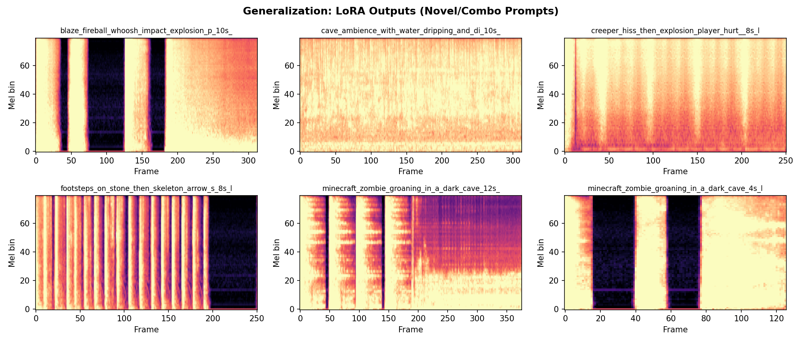

---

# Demo: Sample Prompts & Outputs

### In-Domain Prompts (4s)
| Prompt | Baseline | LoRA |
|---|---|---|
| *"minecraft cave ambience sound effect"* | ✅ Generated | ✅ Generated |
| *"minecraft skeleton death sound effect"* | ✅ Generated | ✅ Generated |
| *"minecraft walking footsteps on stone surface"* | ✅ Generated | ✅ Generated |
| *"minecraft zombie getting hurt sound effect"* | ✅ Generated | ✅ Generated |

### Generalization Prompts (4s–12s)
| Prompt | Duration | Result |
|---|---|---|
| *"creeper hiss then explosion, player hurt sound"* | 8s | Multi-event sequence |
| *"cave ambience with water dripping and distant mobs"* | 10s | Layered ambient |
| *"skeleton hurt, ghast moan, player take damage"* | 4–12s | Combo mob sounds |
| *"blaze fireball whoosh impact explosion"* | 10s | Action sequence |

> 🎧 **Live demo available** — 38 WAV files across baseline, LoRA, and generalization

---

<!-- _class: section-header -->

# 7. Conclusions & Future Work

---

# Conclusions

### Summary
- Systematically explored **6 approaches** for Minecraft sound generation
- **AudioGen LoRA** emerged as the most promising method
  - Autoregressive paradigm more robust to small datasets
  - LoRA enables efficient domain adaptation (132M/1.5B params)
  - Generalization to unseen prompts and longer durations
- **Train-from-scratch** viable but quality limited by dataset size
- **AudioLDM** approaches need larger datasets + more training

### Future Work
- **Larger dataset** — more diverse Minecraft sounds, modded game packs
- **Longer training** — 100+ epochs for AudioGen LoRA
- **Multi-scale LoRA** — different ranks for different layers
- **Perceptual loss** — train with CLAP similarity objective
- **Bit-crush post-processing** — DSP chain for authentic retro aesthetic
- **Evaluation** — human listening tests, FAD metrics
- **Applications** — procedural game audio, Minecraft mod integration

---

<!-- _class: lead -->

# Thank You

### Questions?

**Repository:** github.com/BHatiru/GenAI-Minecraft-Sounds
**38 generated samples** available for listening
**7 LoRA checkpoints** saved for reproducibility
