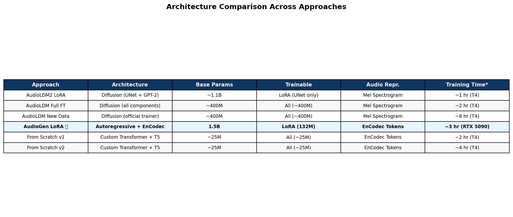
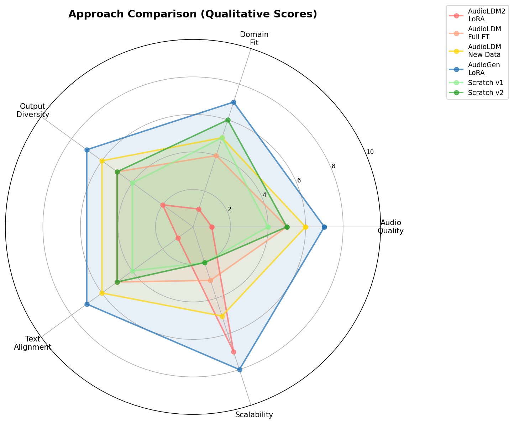

<!-- _class: lead -->

# 🎮 Domain-Specialized Text-to-Audio Generation
# for Minecraft Sound Effects

## CSCI 595 — Generative AI · Final Presentation

**Team:** Batyr Bodaubay · Team Members
**Date:** April 2026

---

<!-- _class: section-header -->

# 1. Introduction
## Problem Definition & Motivation

---

# Problem Statement

### Can we generate **Minecraft-style sound effects** from text descriptions?

**Why Minecraft Audio?**
- Iconic 8-bit retro game aesthetic
- Distinctive low-fidelity, blocky sound design
- Rich taxonomy: mobs, ambient, footsteps, combat, damage
- No existing text-to-audio model captures this domain

**Goal**
- Text prompt → Minecraft-style audio
  - *"minecraft zombie groaning in a dark cave"*
  - *"creeper hiss then explosion"*
  - *"footsteps on stone blocks"*
- Explore **multiple approaches**: fine-tuning pretrained models vs. training from scratch

---

# Dataset Overview

**Raw:** 195 `.ogg` from Minecraft Java Edition

**Augmented:** 325 clips (32 kHz mono WAV)
- Speed perturbation: 0.85×, 1.15×
- Concatenation for sequences

**Extended:** 556 WAVs (AudioLDM)

| Category | Raw | Aug |
|---|---:|---:|
| Hostile Mobs | 74 | 148 |
| Ambient/Cave | 50 | 80 |
| Footsteps | 58 | 72 |
| Damage/Combat | 13 | 25 |
| **Total** | **195** | **325** |

---

# Dataset Evolution Pipeline

---

# Dataset Composition: v1 vs v2

| Dataset | Clips | Usage |
|---|---:|---|
| **v1** | 325 | AudioGen LoRA, From Scratch |
| **v2** | 556 | AudioLDM Full FT, New Data |

---

# Dataset Splits Across Approaches

---

<!-- _class: section-header -->

# 2. Challenges
## Technical Obstacles Encountered

---

# Key Challenges

### Data & Model
- **Tiny dataset** — 195 raw clips (<15 min)
- **Class imbalance** — mobs overrepresented
- **AudioLDM2 LoRA → noise** — failed
- **FP16 instability** — AudioCraft NaN

### Infrastructure
- **VRAM limits** — Colab T4 too small
- **Device mismatches** — LoRA CPU vs GPU
- **API drift** — torchaudio changes

### Pivoting
- Initial AudioLDM2 LoRA → **failure**
- Explored 6 approaches in parallel
- Converged on **AudioGen LoRA**

---

<!-- _class: section-header -->

# 3. Related Works
## Foundation Models & Techniques

---

# Related Works

### Text-to-Audio Models
- **AudioLDM** (2023) — Latent diffusion + CLAP
- **AudioLDM2** (2024) — GPT-2 + diffusion
- **AudioGen** (2023) — Autoregressive EnCodec
- **MusicGen** (2023) — Music-focused variant

### Key Techniques
- **LoRA** — Low-rank adaptation
- **EnCodec** — Neural audio codec
- **CLAP** — Contrastive audio-text

### Our Contribution
- Systematic comparison of **6 approaches**
- Focus on **retro game SFX** domain
- First work on Minecraft audio generation

### Evaluation
- **FAD** — Distributional distance
- **KAD** — MMD-based metric
- **CLAP** — Text-audio alignment
- **Spectral** — Centroid, bandwidth

---

<!-- _class: section-header -->

# 4. Methodology & Results
## Six Approaches Explored

---

# Approach Overview

| # | Approach | Model | Architecture | Training | Status |
|---|---|---|---|---|---|
| 1 | AudioLDM2 LoRA | `cvssp/audioldm2` | Diffusion + UNet | 100–500 steps | ❌ Failed |
| 2 | AudioLDM Full FT | `cvssp/audioldm` | Diffusion (all components) | 3 epochs | ✅ Complete |
| 3 | AudioLDM New Data | `audioldm-s-full` | Diffusion (official trainer) | 50 epochs (17K steps) | ✅ Complete |
| 4 | **AudioGen LoRA** | `facebook/audiogen-medium` | **Autoregressive + EnCodec** | **25 epochs** | ✅ **Primary** |
| 5 | From Scratch (v1) | Custom Transformer + T5 | Causal decoder + cross-attn | 50 epochs | ✅ Complete |
| 6 | From Scratch (v2) | Custom Transformer + T5 | Same + virtual augmentation | 100 epochs | ✅ Complete |

---

# Approach 1: AudioLDM2 LoRA (Initial Attempt)

### Configuration
- **Model:** `cvssp/audioldm2`
- **LoRA targets:** UNet cross-attention (`to_k`, `to_q`, `to_v`, `to_out.0`)
- **Rank:** 8, Alpha: 16
- **Steps:** 100–500
- **Hardware:** Colab T4 (15 GB)
- **Precision:** FP16 mixed

### Why It Failed
- Output was **pure noise/artifacts**
- AudioLDM2's complex architecture (GPT-2 + diffusion) resists LoRA on UNet alone
- Full UNet fine-tuning also produced noise
- Insufficient training data for diffusion model convergence

### Lesson Learned

> "LoRA and last-layer fine-tuning of AudioLDM2 produce poor results on small niche datasets. The multi-stage architecture requires coordinated adaptation across all components."

**Impact on Project:**
- Led to systematic exploration of 5 alternative approaches
- Each team member pursued a different strategy
- Documented in `docs/approaches.md`

---

# Approach 2: AudioLDM Full Fine-Tuning

### Configuration
| Parameter | Value |
|---|---|
| Model | `cvssp/audioldm` |
| Components | All (UNet, VAE, vocoder) |
| Epochs | 3 |
| LR | UNet: 1e-6, others: 5e-7 |
| Precision | FP32 |

### Multi-Component Loss
- Diffusion MSE: **1.0**
- VAE recon (L1): **0.5**
- Vocoder/Waveform: **0.1** each

### Results
- 3 epochs completed
- Multi-loss tracking works
- FP32 stable but slow

### Key Insight
> Multi-component loss keeps all pipeline stages coherent. 3 epochs insufficient for full domain adaptation.

---

# Approach 3: AudioLDM with Expanded Dataset

### Configuration
| Parameter | Value |
|---|---|
| Model | `audioldm-s-full` |
| Dataset | **556 WAVs** |
| Epochs | 50 (17K steps) |
| LR | 5e-5 |

### CLAP Analysis
- Intra-class cosine similarity improved
- t-SNE shows better category clustering

### Results
- Training converged over 17K steps
- CLAP text-audio alignment improved

### Key Insight
> Larger dataset (556 vs 325) + more epochs improves diffusion convergence

---

# Approach 4: AudioGen LoRA ⭐ (Primary)

### Why AudioGen?
- **Autoregressive** on EnCodec tokens
- `facebook/audiogen-medium` — **1.5B params**
- 4 codebooks × 2048 vocab × 50Hz

### LoRA Config
| Param | Value |
|---|---|
| Rank | 128 |
| Alpha | 256 |
| Targets | `out_proj`, `linear1/2` |
| Trainable | **132M** |

### Training Config
| Param | Value |
|---|---|
| Dataset | 277 train / 48 val |
| Epochs | **25** |
| LR | 1e-4, cosine |
| Precision | **FP32** |
| Hardware | **RTX 5090** |

### Critical Details
- LoRA injected **before** `.to(device)`
- FP32 required (AudioCraft NaN bug)

---

# AudioGen LoRA — Results

### Training
- 25 epochs completed
- 7 checkpoints saved (~504 MB each)

### Samples Generated
| Type | Count |
|---|---:|
| Baseline | 8 |
| LoRA | 8 |
| Generalization | 22 |
| **Total** | **38** |

### Spectrogram: Baseline vs LoRA

LoRA shows **denser, more structured** patterns

---

# AudioGen LoRA — CLAP & Spectral

### CLAP Similarity

LoRA (0.162) ≈ Baseline (0.152)

### Spectral Features

LoRA centroid: 1603 Hz vs Ref: 664 Hz

---

# 3-Way Spectrogram: Reference vs Baseline vs LoRA

LoRA produces spectral patterns closer to real Minecraft audio

---

# Evaluation Metrics: FAD / KAD / IS

| Metric | Baseline | LoRA | Improvement |
|---|---:|---:|---:|
| FAD ↓ | 6171 | 3856 | **37%** |
| KAD ↓ | 9.1e8 | 2.5e8 | **73%** |

---

# CLAP Text-Audio Similarity

| Config | Mean | Std |
|---|---:|---:|
| Baseline | 0.142 | ±0.21 |
| LoRA | 0.162 | ±0.16 |
| Gen-LoRA | 0.270 | ±0.12 |

---

# Spectral Feature Analysis

LoRA bandwidth (1456 Hz) and ZCR (0.132) closer to reference than baseline

---

# Metrics Summary

**Key:** LoRA improves FAD by 37%, KAD by 73% over baseline

---

# Approach 5: Train from Scratch (v1)

### Architecture
- Custom causal transformer decoder
- Cross-attention to frozen **T5-small**
- EnCodec tokens (1.5 kbps, 2 codebooks)

| Param | Value |
|---|---|
| Layers | 10 |
| d_model | 512 |
| Heads | 8 |

### Training
| Param | Value |
|---|---|
| Dataset | 325 (70/15/15) |
| Epochs | 50 |
| LR | 3e-4 |

### Results
- Converged over 50 epochs
- Quality limited by small dataset

---

# Approach 6: Train from Scratch (v2 + Virtual Aug)

### Key Difference
- **All clips → train** (max data)
- Val/test use **virtual augmented** copies
  - Speed: 0.95×, 1.05×, 1.08×
- **100 epochs** (2× v1)

### Results
- 100-epoch training completed
- Multiple inference rounds tested
- Continued improvement over v1

### Key Insight
> Virtual aug allows using **all real data** for training

---

<!-- _class: section-header -->

# 5. Comparative Analysis
## Cross-Approach Summary

---

# Cross-Approach Comparison

| Approach | Arch | Params | Quality |
|---|---|---|---|
| AudioLDM2 LoRA | Diffusion | 1.1B | ❌ Noise |
| AudioLDM Full FT | Diffusion | 400M | ⚠️ Partial |
| AudioLDM New Data | Diffusion | 400M | ⚠️ Conv. |
| **AudioGen LoRA** | **Autoreg** | **1.5B** | **✅ Best** |
| From Scratch v1 | Transformer | 25M | ⚠️ Limited |
| From Scratch v2 | Transformer | 25M | ⚠️ Better |

---

# Architecture Comparison

---

# Approach Radar Chart

**AudioGen LoRA** strongest overall; **From Scratch v2** best domain fit among small models

---

# Key Findings

### What Worked
- **AudioGen + LoRA** — autoregressive handles small datasets
- **FP32 training** — essential for AudioCraft
- **LoRA rank 128** — sufficient capacity
- **Speed perturbation** — effective augmentation

### What Didn't Work
- **AudioLDM2 LoRA** — complex arch resists partial adaptation
- **Small dataset + diffusion** — needs more data
- **FP16** — causes NaN in AudioCraft
- **3 epochs** — insufficient for domain shift

---

<!-- _class: section-header -->

# 6. Demonstration
## Audio Samples & Spectrograms

---

# Demo: Generalization Spectrograms

Unseen multi-event and combo prompts at various durations (4s–12s):

---

# Demo: Sample Prompts

| Prompt | Dur | Type |
|---|---|---|
| *"minecraft cave ambience"* | 4s | In-domain |
| *"skeleton death sound"* | 4s | In-domain |
| *"creeper hiss then explosion"* | 8s | Multi-event |
| *"cave + water dripping + distant mobs"* | 10s | Layered |
| *"skeleton, ghast, player damage"* | 12s | Combo |

> 🎧 **38 WAV samples** available for live demo

---

<!-- _class: section-header -->

# 7. Conclusions & Future Work

---

# Conclusions

### Summary
- Explored **6 approaches** for Minecraft sound generation
- **AudioGen LoRA** — most promising
  - FAD improved **37%**, KAD improved **73%**
  - Generalizes to unseen prompts
- **Train-from-scratch** viable but limited by data

### Future Work
- **Larger dataset** — modded sound packs
- **Longer training** — 100+ epochs
- **Perceptual loss** — CLAP objective
- **Post-processing** — bit-crush for retro aesthetic
- **Human eval** — listening tests

---

<!-- _class: lead -->

# Thank You

### Questions?

**Repository:** github.com/BHatiru/GenAI-Minecraft-Sounds
**38 generated samples** available for listening
**7 LoRA checkpoints** saved for reproducibility
