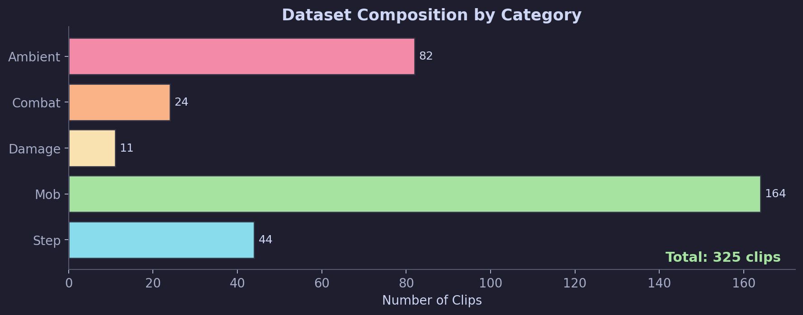
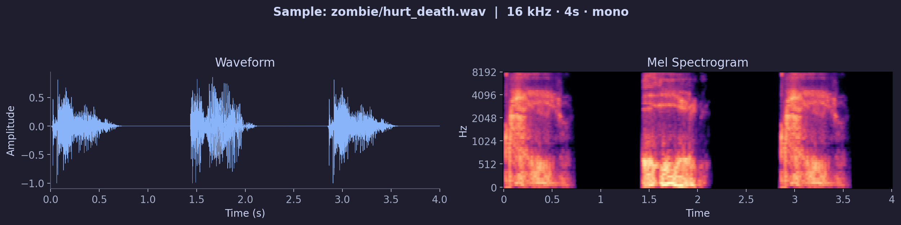
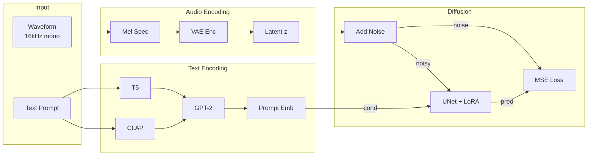
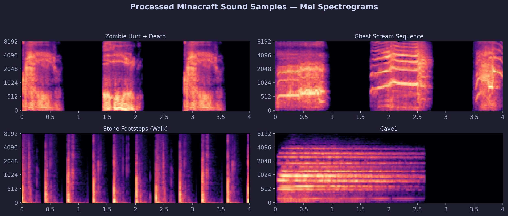

<!-- _class: lead -->

# Domain-Specialized Text-to-Audio Generation for Minecraft Sound Effects

## CSCI 595 — Generative AI · Progress Report

Spring 2026

---

## Problem Statement

- **General-purpose text-to-audio models** (e.g., AudioLDM2) produce generic sounds when prompted with game-specific descriptions
- Minecraft has a **distinctive 8-bit / lo-fi sound aesthetic** that vanilla models cannot replicate
- **Goal:** Adapt a pre-trained diffusion audio model to generate sounds that match Minecraft's sonic identity
  - Mob sounds (zombie, skeleton, creeper, ghast …)
  - Footsteps on various surfaces (stone, wood, grass …)
  - Ambient & environmental audio (cave, nether, weather …)

---

## Model: AudioLDM2

| Component | Role |
|-----------|------|
| **CLAP text encoder** | Encode prompts into audio-aligned embeddings |
| **T5 text encoder** | Secondary language understanding |
| **GPT-2 language model** | Fuse dual text representations |
| **UNet** | Iterative denoising in latent space |
| **VAE** | Encode/decode mel spectrograms ↔ latents |
| **HiFi-GAN vocoder** | Mel spectrogram → waveform |

- Pre-trained checkpoint: `cvssp/audioldm2` (Hugging Face)
- Latent diffusion — works in compressed mel-spectrogram space

---

## Dataset: Minecraft Sound Assets

**Source:** Official Minecraft Java Edition assets via GitHub (`misode/mcmeta`)

| Category | Examples | Raw files |
|----------|----------|-----------|
| Hostile mobs | zombie, skeleton, creeper, spider, endermen, blaze, ghast | ~74 .ogg |
| Ambient | cave, nether, underwater, weather | ~50 .ogg |
| Footsteps | stone, wood, grass, sand, gravel … (11 surfaces) | ~58 .ogg |
| Damage | hit, fall | ~5 .ogg |
| **Total raw** | | **~195 .ogg** |

---

## Dataset — After Augmentation



---

## Data Processing Pipeline

```
Raw .ogg → Resample 16 kHz mono → Silence trim → Augmentation → 4s fixed-length .wav
```

**Augmentation:** mob sequences (hurt → death), footstep walk/run patterns, damage combos, ambient slow variants, ±10% speed perturbation

**Result:** 195 raw → **325 clips** (277 train / 48 val), each with auto-generated caption

<!-- Waveform + spectrogram of a processed sample -->


---

## Our Approach — LoRA on UNet

- Freeze all components (VAE, text encoders, GPT-2, vocoder)
- Apply **LoRA** to UNet cross-attention: `to_k`, `to_q`, `to_v`, `to_out.0`
- Rank = 8, alpha = 16

**Training loop:**
waveform → mel → VAE latent → add noise → UNet predicts noise → MSE loss

<!-- Architecture / training pipeline diagram -->



---

## Our Approach — Training Details

| Parameter | Value |
|-----------|-------|
| Batch size | 1 (×4 gradient accumulation) |
| Learning rate | 1e-4, cosine schedule |
| Steps | 100–500 |
| Precision | FP16 mixed |
| Hardware | Colab T4 (15 GB VRAM) |
| Framework | PyTorch + Diffusers + PEFT |

```
GenAI-Minecraft-Sounds/
├── configs/demo1.yaml           # all hyperparams
├── scripts/                     # fetch, preprocess, manifest
├── src/mcaudio/train/           # LoRA training
├── src/mcaudio/infer/           # generation with/without LoRA
└── notebooks/demo1_colab.ipynb  # one-click Colab demo
```

---

## Experiments & Results So Far

### Baseline — Vanilla AudioLDM2
- Generated audio for Minecraft-style prompts without fine-tuning
- Produces plausible generic sounds but **nothing resembling Minecraft's aesthetic**

### LoRA Fine-Tuning (UNet Cross-Attention)
- Trained LoRA adapters for 100–500 steps on 277-clip dataset
- Output is mostly noise / artifacts — not yet usable

### Full UNet Fine-Tuning
- A teammate fine-tuned all UNet parameters directly
- Similar failure — also produced noise

---
## Data
<!-- Mel spectrograms across 4 categories -->


---

## Upcoming Work

**Follow official fine-tuning recipes** from Diffusers / AudioLDM2 developers
- Use reference implementations with known-good training configurations
- Validate latent encoding roundtrip (encode → decode) before training

**Try alternative adaptation methods**
- DreamBooth-style fine-tuning for AudioLDM2
- Textual Inversion — learn new token embeddings for "minecraft style"
- Full fine-tuning with lower LR + more data

**Scale & evaluate**
- Expand dataset with more Minecraft sound categories
- Evaluation: FAD (Fréchet Audio Distance), CLAP similarity score

---

## Summary

| Component | Status |
|---|---|
| Dataset pipeline (fetch → preprocess → manifest) | ✅ Complete |
| Baseline generation (vanilla AudioLDM2) | ✅ Working |
| LoRA + full UNet training infrastructure | ✅ Built |
| Fine-tuned generation quality | ❌ Not yet satisfactory |
| Official recipe validation | 🔜 Next step |

**Key takeaway:** End-to-end infrastructure is in place. Next step is following the model developers' proven training recipes.

---

<!-- _class: lead -->

# Thank You

### Questions?

Repository: `github.com/BHatiru/GenAI-Minecraft-Sounds`
